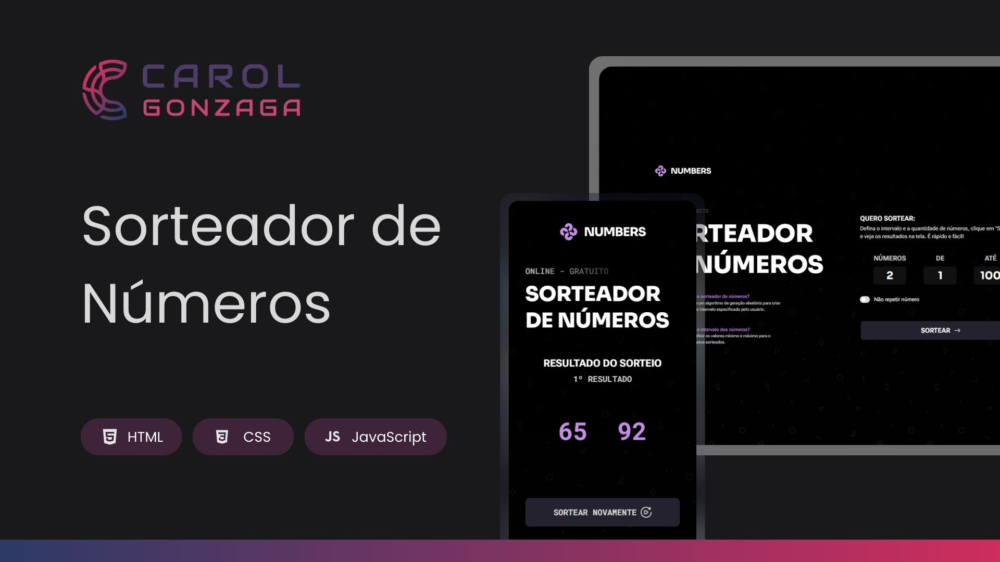

  

 

Uma aplicação de sorteio de números com abordagem totalmente responsiva e animações interativas.

  <a href="#-tecnologias">Tecnologias</a>&nbsp;&nbsp;&nbsp;|&nbsp;&nbsp;&nbsp;<a href="#-objetivo">Objetivo</a>&nbsp;&nbsp;&nbsp;|&nbsp;&nbsp;&nbsp;<a href="#-funcionalidades">Funcionalidades</a>&nbsp;&nbsp;&nbsp;|&nbsp;&nbsp;&nbsp;<a href="https://carolgonzaga.github.io/sorteador-de-numeros/" target="_blank">Acesse o Projeto</a>

 
 

  

 
 

## 🚀 Tecnologias

Esse projeto foi desenvolvido com as seguintes tecnologias:

- HTML5
- CSS3 (com variáveis CSS, media queries e animações com keyframes)
- JavaScript (manipulação do DOM)

 
 

## 🎯 Objetivo

O objetivo deste projeto é praticar conceitos fundamentais de JavaScript e CSS, incluindo:

- Manipulação de elementos HTML com JavaScript
- Lógica de geração de números aleatórios
- Controle de repetição e intervalo de números
- Uso de animações em elementos SVG
- Responsividade para diferentes tamanhos de tela

 
 

## 🛠️ Funcionalidades

A aplicação permite que o usuário:

- Defina um intervalo mínimo e máximo para o sorteio
- Escolha quantos números deseja sortear
- Ative ou desative a repetição de números
- Veja o resultado animado, número por número
- Inicie novos sorteios sequenciais com contagem automática
- Tenha uma experiência fluida em dispositivos móveis e desktops
